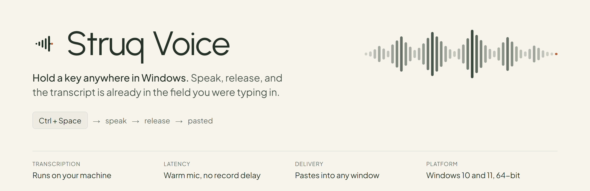
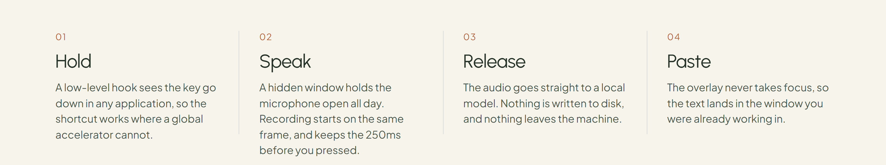
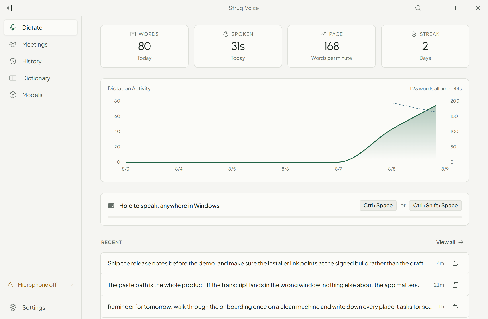
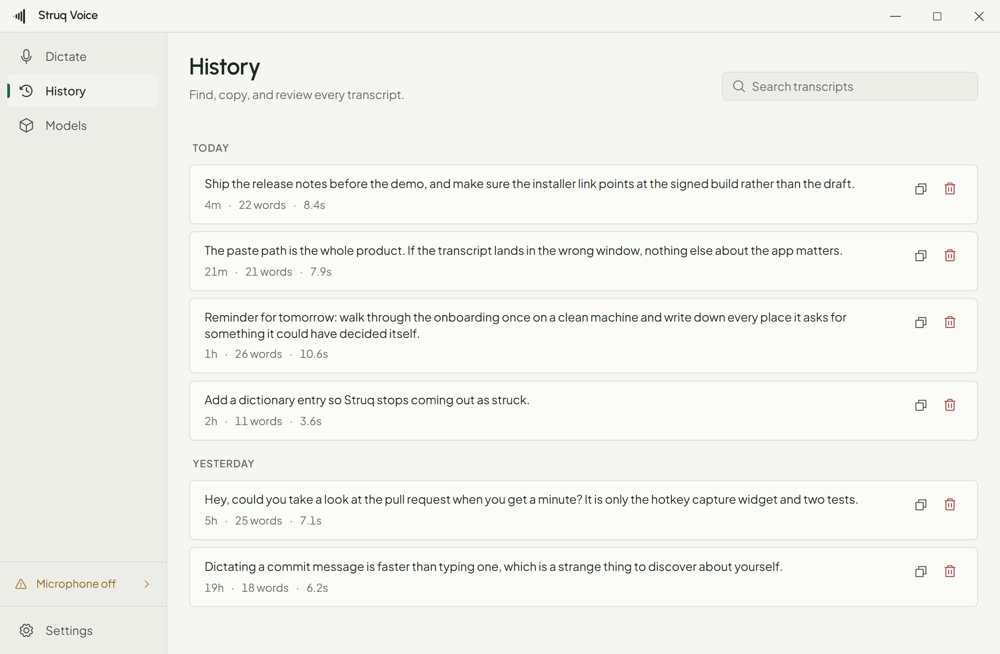
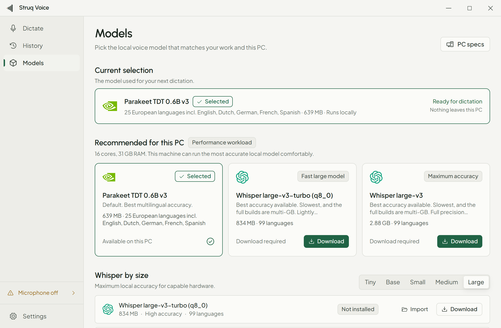
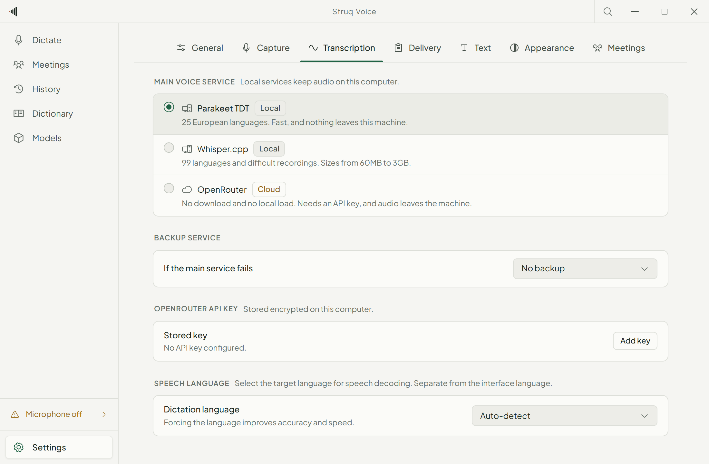
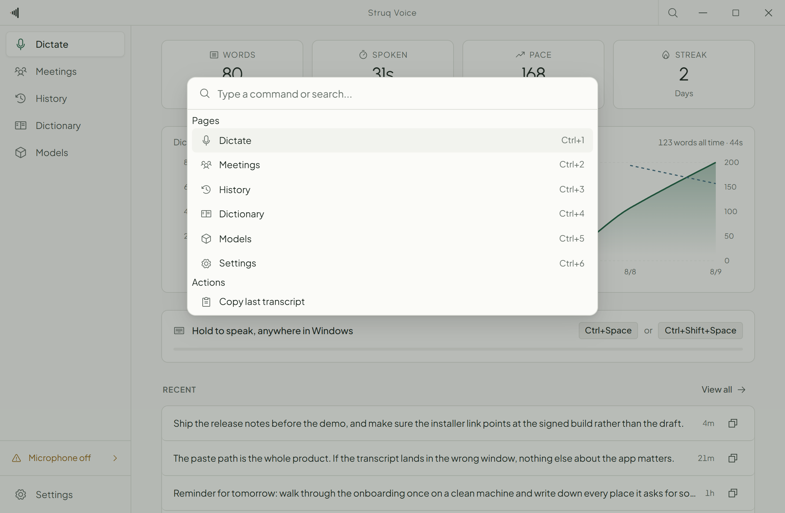

<div align="center">



#  Struq Voice

### *Dictation that lands in the window you were already working in*

**On-device transcription · Works in every application · Never steals focus**

[](https://github.com/Deckdot/struq-voice/releases/latest)
[](https://github.com/Deckdot/struq-voice/actions/workflows/ci.yml)
[](LICENSE)
[](#install)
[](https://www.electronjs.org/)
[](https://react.dev/)
[](https://www.typescriptlang.org/)

[⬇ Download](#install) &nbsp;·&nbsp; [What it does](#what-it-does) &nbsp;·&nbsp; [A look inside](#a-look-inside) &nbsp;·&nbsp; [How it works](#how-it-works) &nbsp;·&nbsp; [Build from source](#build-from-source)

---

</div>

## Dictation, without the round trip

Most dictation on Windows asks you to leave what you are doing. You open an app,
you record, you wait, you copy, you go back, you paste. By the time the sentence
is in the document the thought that produced it is gone.

Struq Voice removes every step except the sentence. It sits in the tray with the
microphone already open. You hold a key in whatever window you are in, you talk,
you let go, and the text appears at the caret. Nothing is uploaded, nothing is
saved to disk as audio, and the window you were working in never loses focus.



---

## What it does

### Capture that starts on the first syllable

- **Press and hold anywhere.** `Ctrl+Space` by default, in any application,
  including ones that swallow global shortcuts. A low-level keyboard hook reads
  key-down and key-up, which a normal global accelerator cannot do.
- **Toggle mode** on `Ctrl+Shift+Space` for long dictation, and `Escape` to
  throw a capture away mid-sentence.
- **A permanently warm microphone.** A hidden window holds `getUserMedia` open
  with an AudioWorklet running, so a capture begins by appending to a buffer.
  There is no 100 to 300ms device-open delay in the hot path.
- **250ms of pre-roll.** The audio from just before the key went down is part of
  the capture, so an early first word is never clipped.
- **Guard rails.** Anything under 350ms is discarded silently so a mistyped key
  never pastes, and a stuck key is force-stopped by a watchdog at five minutes.
- **Rebind anything** in Settings with a key-capture widget. New keys register
  at runtime, with no restart.

### Three engines, and a router that knows the difference

| Engine | Where it runs | What it is for |
|---|---|---|
| **Parakeet TDT 0.6B** | On your machine | The default. 25 European languages, loaded once and kept warm in the background. |
| **Whisper.cpp** | On your machine | 99 languages and difficult audio. GPU capable through a `whisper-cli.exe` sidecar, with a CPU fallback. |
| **OpenRouter** | Cloud | Zero setup and no local load. Needs an API key, and the cost of every transcription is recorded. |

The router cascades from a primary engine to a fallback when one is not ready,
errors, or times out. **A local engine never falls back to a cloud engine
without explicit opt-in**, because that would move your audio off the machine to
recover from an error you did not see.

### A model catalog that makes the choice for you

- **Thirty-one builds** in the catalog, from a 32MB Whisper tiny to the 3GB
  large-v3, with real file sizes and sha256 digests taken from the Hugging Face
  API rather than guessed.
- **One recommendation per machine.** Struq Voice reads cores, memory and GPU
  vendor, then names the model that fits and says which hardware fact decided
  it. A list of thirty-one entries with no default is a decision handed to
  someone with no basis for making it.
- **Downloads that survive real networks.** Resumable range requests, three
  concurrent files at most, sha256 verification, an atomic move into place, and
  a cancel button that actually cancels.
- **Import a folder** you already have, and it is copied then verified against
  the same digests.
- **Measured realtime factor per engine**, computed from your own History rows
  rather than a number from a benchmark on someone else's machine.

### Delivery that lands in the right window

- The overlay is created `focusable: false`, so the Windows foreground window
  never changes while a capture is live. The paste therefore arrives in the
  application you were actually using.
- Delivery is a synthesized `Ctrl+V` through the same low-level hook, at roughly
  2ms, with a PowerShell fallback for the rare window that refuses it.
- If one of our own windows has focus, the transcript is inserted directly
  instead.
- **Your clipboard is put back** after the paste, with a configurable delay for
  applications that read it slowly.

### Everything you ever said, searchable

- Every transcript in SQLite with **FTS5 full-text search**, so a phrase from
  three weeks ago is one query away.
- The list is virtualized, so thousands of rows scroll at full speed.
- Copy or delete any row, with the engine, duration and cloud cost kept beside
  it.
- Transcripts are set in a serif reading face at reading size. A dictation app's
  output is writing, and it should look like writing.

### Text that arrives finished

- Whitespace is always trimmed and collapsed.
- **A custom dictionary** for what a model reliably gets wrong: "tow ree"
  becomes "Tauri", "struck" becomes "Struq", before the text is delivered.
- Optional filler removal for "um" and "uh", and optional trailing punctuation.
- Every rule is a pure function with unit tests, because text mangling that
  cannot be tested is text mangling you cannot trust.

### A first run that leaves you with a working app

Four steps: microphone, hotkey, engine, and one real capture you perform
yourself. The microphone step arrives already satisfied with a live meter, the
hotkeys are already registered, and the recommended model starts downloading
when the step mounts rather than when you reach it. Skipping is as cheap as
continuing and still leaves a working app.

### Resident, not in the way

- Starts with Windows, hidden to the tray. Closing the window hides it rather
  than quitting.
- The tray icon has three states, a tooltip carrying the engine and the current
  state, your recent transcripts, a capture toggle, an engine radio group, pause
  and quit.
- A search palette on `Ctrl+F` for anyone who would rather not reach for the
  mouse.

### Updates you can actually trust

Struq Voice ships without a code signing certificate, so an update channel would
otherwise mean "run whatever the feed serves". Every artifact carries an
**Ed25519 signature over `<sha512>|<version>`**, verified against a public key
compiled into the app before anything is installed. A failed check aborts the
install instead of warning about it, and the version inside the signed message
means a genuinely signed older build cannot be replayed as a downgrade.

### 🔒 Privacy

Parakeet and Whisper.cpp run entirely on your machine. Dictation audio is held
in memory as PCM, cut into a WAV in memory, transcribed, and dropped. It is not
written to disk or sent anywhere. Meetings can keep an explicit local recording
when archiving is enabled; that file stays in the meeting library until removed.

Audio leaves the machine only when you choose OpenRouter yourself, and that
choice is never made for you by a fallback. The API key is stored encrypted with
Windows DPAPI through Electron `safeStorage`, is masked in the interface, and
never crosses IPC back into a renderer.

---

## A look inside

<table>
  <tr>
    <td width="50%" valign="top">
      
      <p><strong>Dictate</strong><br/>A readiness home rather than a dashboard. Each row states what is true now, and a row that is not ready names the cause and offers the fix in the same place.</p>
    </td>
    <td width="50%" valign="top">
      
      <p><strong>History</strong><br/>Every transcript, searchable through FTS5, virtualized, and set in the reading face the words deserve.</p>
    </td>
  </tr>
  <tr>
    <td width="50%" valign="top">
      
      <p><strong>Models</strong><br/>The one model this machine should run, named with the hardware that chose it, above the full catalog for anyone who wants to choose.</p>
    </td>
    <td width="50%" valign="top">
      
      <p><strong>Settings</strong><br/>Capture, Transcription, Delivery and Text behind a sub-nav, with timing values under Advanced. Everything applies immediately.</p>
    </td>
  </tr>
</table>

<div align="center">
  
  <p><em>Ctrl+F reaches every view and the actions worth a shortcut.</em></p>
</div>

---

## How it works

Four processes, each with exactly one job, and a single state machine that every
surface renders from.

```text
MAIN PROCESS                RECORDER (hidden)          OVERLAY (never focused)
lifecycle, tray             warm getUserMedia          capture pill, waveform
hotkeys, session            AudioWorklet to PCM        transcribing, delivered
engines, paste, history     streamed to main
settings, updater
                                                       MAIN WINDOW (on demand)
                                                       Dictate, History,
                                                       Models, Settings
```

A capture is one path through one state machine. Tray, overlay and main window
all read from broadcasts of it; nothing else owns capture state.

```text
idle ──arm──▶ arming ──ready──▶ listening ──stop──▶ transcribing ──ok──▶ delivering
  ▲             │                   │                    │                    │
  │             └──fail─────────────┴───cancel───────────┘                    │
  └────────── error ◀───────────────┴────────fail────────┘                    │
  └──────────────────────── done (auto after 900ms) ◀─────────────────────────┘
```

Audio is 16kHz mono Int16 throughout. It is transferred to main as an
`ArrayBuffer`, cut into a WAV in memory, transcribed, cleaned up, and pasted.

**The boundaries that hold this together:**

- The renderer never imports from `src/main/`.
- `src/shared/` has no side effects and no Electron imports, so it runs in any
  process and in tests.
- Every IPC channel is declared in `src/shared/ipc.ts` and nowhere else.
- Every window is `contextIsolation: true`, `nodeIntegration: false`,
  `sandbox: true`. No exceptions.
- Every native module degrades rather than blocking boot. Without
  `better-sqlite3` there is no history, without `uiohook-napi` push-to-talk
  falls back to toggle, without `sherpa-onnx-node` Parakeet reports that its
  runtime is missing. The app still starts and still works.

---

## Keys

| Key | What it does |
|---|---|
| `Ctrl+Space` | Hold to record. Release to transcribe and paste. |
| `Ctrl+Shift+Space` | Toggle a capture on, then off. |
| `Escape` | Cancel the capture in progress. Registered only while one is live. |
| `Ctrl+F` | Search palette, in the main window. |

All of them are rebindable in Settings.

---

## Install

**Requirements:** Windows 10 or 11, 64-bit, and a microphone.

1. Download `struq-voice-<version>-setup.exe` from the
   [latest release](https://github.com/Deckdot/struq-voice/releases/latest).
2. Run it. The installer is per-user and does not need elevation, so it will not
   ask for an administrator.
3. Struq Voice starts in the tray and walks you through four short steps. The
   recommended model downloads while you read them.

The installer does not yet have a commercial Windows code-signing certificate.
SmartScreen may therefore show **Windows protected your PC** on the first
install. Confirm that the installer came from the official release above. If
you are comfortable continuing, choose **More info**, then **Run anyway**. The
certificate is a recurring cost for a free project; application updates use the
independent Ed25519 verification described in [Releasing](docs/RELEASING.md).

Updates are checked in the background and verified against the release signature
before they are installed. You can also check by hand in Settings under
Delivery.

---

## Build from source

**Requirements:** Node 22 or newer, pnpm 10, and the Visual Studio build tools
that native modules need on Windows.

```bash
git clone https://github.com/Deckdot/struq-voice.git
cd struq-voice
pnpm install     # native modules are rebuilt for Electron 39 automatically
pnpm dev
```

The deterministic Mock engine is registered only by the test harness. It is not
shown as a selectable engine in normal or packaged builds.

If a native module fails to load, `docs/TROUBLESHOOTING.md` covers the known
cases.

### Scripts

| Script | What it does |
|---|---|
| `pnpm dev` | Run in development with hot reload |
| `pnpm build` | Build main, preload and all three renderers |
| `pnpm typecheck` | TypeScript across the node, web and e2e projects |
| `pnpm lint` | ESLint on `strictTypeChecked` |
| `pnpm test` | Vitest unit tests |
| `pnpm test:coverage` | Audit risk-area coverage without enforcing a vanity threshold |
| `pnpm test:e2e` | Build, then Playwright end to end, headless |
| `pnpm smoke:boot` | Build and verify a hidden app boot with isolated user data |
| `pnpm pack` | Build and unpack to `release/win-unpacked` |
| `pnpm dist` | Build the NSIS installer |
| `pnpm release:auto` | Cut a version, build, sign, verify and publish |
| `pnpm docs:art` | Re-render the README banner art |
| `pnpm docs:shots` | Re-capture the README screenshots from the real app |

### Repository layout

| Path | What lives there |
|---|---|
| `src/main/` | Lifecycle, hotkeys, capture session, engines, models, paste, database, updater |
| `src/preload/` | One sandboxed bridge per window type |
| `src/renderer/main/` | The main window: Dictate, History, Models, Settings |
| `src/renderer/overlay/` | The capture pill and its waveform |
| `src/renderer/recorder/` | The warm microphone and the PCM worklet |
| `src/shared/` | Types, IPC channel names, settings schema, model catalog |
| `e2e/` | Playwright specs against the built app |
| `docs/` | Architecture, design system, models, releasing, troubleshooting |

### Quality gates

The only definition of done in this repository:

```bash
pnpm typecheck
pnpm lint
pnpm test
```

`pnpm test:e2e` is run deliberately rather than casually: it builds first, and
one spec needs a real microphone and real OS focus.

---

## Design

Every surface is built against one binding document,
[`docs/DESIGN_SYSTEM.md`](docs/DESIGN_SYSTEM.md): **Evergreen and Ember**. A
warm porcelain page and a deep green-undertoned charcoal dark theme, one
pine accent for primary actions, and an ember color reserved for live
capture feedback.
Instrument Sans for the interface, Instrument Serif for prose and for the
transcript itself, IBM Plex Mono for anything numeric.

It also says what never ships: no gradient text, no glassmorphism, no purple to
blue AI palette, no glows, no shadow stacks on ordinary cards, no emoji in the
interface, and no error message that names a problem without naming the fix.

---

## Documentation

| Document | What it covers |
|---|---|
| [`AGENTS.md`](AGENTS.md) | The source of truth: what this project is, the rules, how work is gated |
| [`docs/ARCHITECTURE.md`](docs/ARCHITECTURE.md) | Process and window model, boundaries |
| [`docs/DESIGN_SYSTEM.md`](docs/DESIGN_SYSTEM.md) | Evergreen and Ember, binding on every view |
| [`docs/FEATURES.md`](docs/FEATURES.md) | What is built, current state, known gaps |
| [`docs/MODELS.md`](docs/MODELS.md) | Engines, catalog, download pipeline |
| [`docs/RELEASING.md`](docs/RELEASING.md) | Cut, sign, verify, publish, and why updates are signed |
| [`docs/TESTING.md`](docs/TESTING.md) | Risk-weighted test strategy, layers, and review standard |
| [`docs/TROUBLESHOOTING.md`](docs/TROUBLESHOOTING.md) | Known failures and their fixes |

AI agents can load the invokable skills in `.agents/skills/` and the mirrored
`.claude/skills/` for project context, verification gates, IPC architecture,
native modules and the capture session.

---

<div align="center">


**Hold a key. Say the sentence. Carry on working.**

<sub>Designed and engineered by DeckDot &nbsp;·&nbsp; [⬆ Back to top](#-struq-voice)</sub>

</div>
